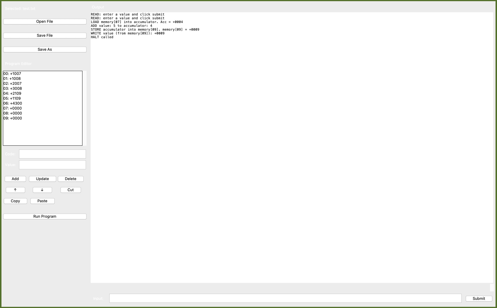

# UVSim
UVSim software simulator CS2450

UVSim is a simple yet powerful virtual machine that interprets programs written in BasicML (Basic Machine Language). It simulates a computer system with CPU, registers, and main memory, capable of executing fundamental arithmetic, I/O, and control operations.

System Architecture

How to run:

    To run the simulator, run the uvsim.py file in the command line
    example:   python uvsim.py

    Use the select file button to select a .txt file
    Then use the run program button to run your program
    If user input is required, enter it in the field next to the submit button, then click the button
    

UVSim consists of:

    100-word memory (locations 00-99)

    Accumulator register for calculations

    Program counter for instruction sequencing

    Instruction set with 13 operations

BasicML Instruction Format

Each instruction is a signed four-digit decimal number:

    First 2 digits: Operation code

    Last 2 digits: Memory address operand

    Example: +3015 = ADD operation using memory location 15

Instruction Set
I/O Operations

    10 READ - Read from keyboard into memory

    11 WRITE - Write from memory to screen

Load/Store Operations

    20 LOAD - Memory → Accumulator

    21 STORE - Accumulator → Memory

Arithmetic Operations

    30 ADD - Memory + Accumulator → Accumulator

    31 SUBTRACT - Accumulator - Memory → Accumulator

    32 DIVIDE - Accumulator / Memory → Accumulator

    33 MULTIPLY - Accumulator * Memory → Accumulator

Control Operations

    40 BRANCH - Jump to address

    41 BRANCHNEG - Jump if accumulator negative

    42 BRANCHZERO - Jump if accumulator zero

    43 HALT - Stop execution

GUI Controls

The interface includes the following elements:

- 'Open File': Load a .txt BasicML program
- 'Save File' and 'Save As': Save the current program
- Program Editor: Edit each instruction by line, using the Code and Value fields
- Add, Update, Delete: Modify instructions
- ↑, ↓, Cut, Copy, Paste: Rearrange or duplicate instructions
- 'Run Program': Execute the program
- Output panel: displays messages, errors, and program output
- Input field: Accepts user input when prompted by READ instructions
- Submit button: Submit typed input

Example Usage

This sample program reads two numbers, adds them, and prints the result:

+1007
+1008
+2007
+3008
+2109
+1109
+4300
+0000
+0000
+0000

If the two inputs are 4 and 5, the expected ouput is 9.

